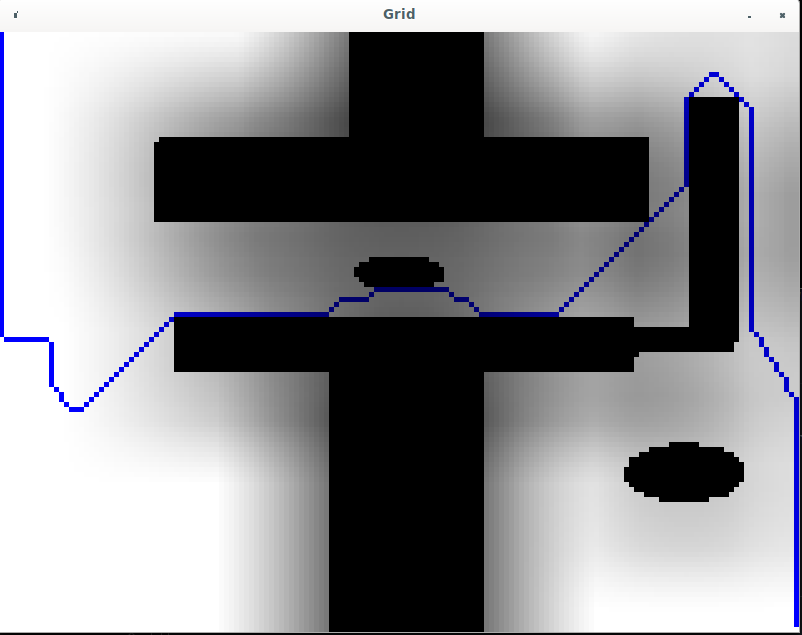

# AGridStar
Super simple sunday afternoon project which implements an A* on a grid map which is generated from a png image

# How to build it

1. Setup opencv on your machine
2. Perhaps adapt the `set(OpenCV_DIR /usr/local/lib/cmake/opencv4)` in the `CMakeLists.txt`
3. mkdir -p build && cd build
4. cmake ..
5. make -j
6. ./map <path to map png>

# Example

